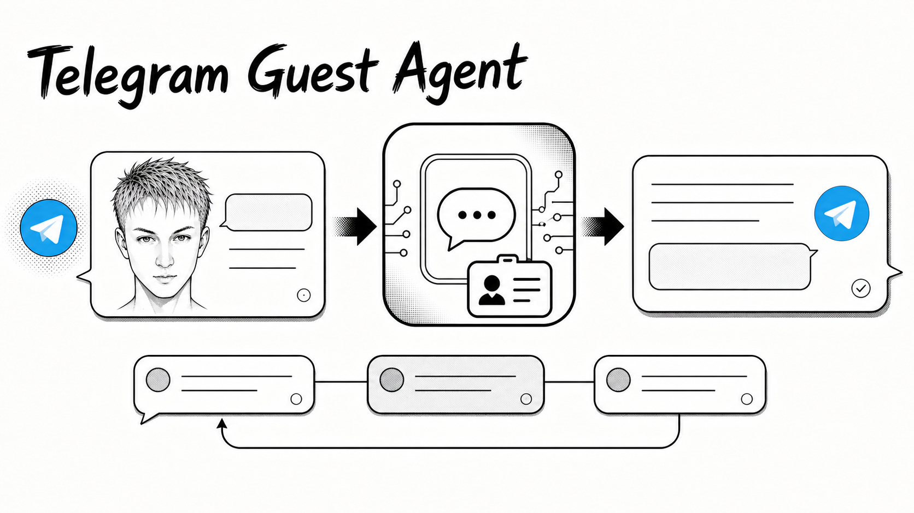

# Telegram Guest Agent

<p align="center">
  
</p>

Owner-only Telegram Guest Mode gateway for Hermes and compatible AI harnesses. It accepts a guest request, gives the agent a stable short-lived reply context, and returns a safe Telegram response without exposing the harness, local files, or credentials.

**Install:** [English](docs/installation.en.md) · [Русский](docs/installation.ru.md)

## What it does

- Polls `guest_message` updates with a dedicated Telegram bot token, avoiding `getUpdates` conflicts with a main bot.
- Fails closed: only the numeric `GUEST_OWNER_ID` may invoke the agent.
- Starts a new session for every standalone invocation; a reply to a recent guest answer continues its session for a configurable TTL (120 seconds by default).
- Uses Hermes Runs when available, passing a stable `session_id`. For a standard OpenAI-compatible Chat Completions endpoint, it keeps a bounded, in-memory six-turn transcript for the same reply window.
- Persists the delivery queue before acknowledging an update, so long agent runs do not block polling and survive a sidecar restart.
- Downloads inbound media into a sandbox, caps its size, and sanitizes local paths in every public answer.
- Stages explicitly allowed local output media through the owner DM before reusing the returned Telegram `file_id` in a public rich reply.
- Uses Bot API rich message blocks when available and falls back to ordinary text if Telegram rejects the rich payload.

## Session behaviour

```text
new @bot request ──> new session
reply to recent guest answer ──> same session, until TTL expires
new @bot request again ──> a different new session
```

The reply relationship is the boundary. The agent never carries history from one standalone request into another just because they are in the same chat.

Hermes Runs is the preferred transport: the harness receives a stable `session_id` and can own long-lived conversation state. Chat Completions mode is compatible with ordinary OpenAI-style endpoints, but its local transcript is deliberately small, process-local, and cleared on gateway restart. It is designed for short reply continuations, not a durable chat archive.

## Quick start

```bash
git clone https://github.com/eugeneb1ack/telegram-guest-agent.git
cd telegram-guest-agent
./init-env.sh
$EDITOR .env
./run-docker.sh
```

Set at least `GUEST_BOT_TOKEN`, `GUEST_OWNER_ID`, `HERMES_API_URL`, `HERMES_API_KEY`, and `HERMES_MODEL` in `.env`. The complete setup for Hermes or another harness is in the [English installation guide](docs/installation.en.md) and [Russian installation guide](docs/installation.ru.md).

Run a connectivity check before enabling polling:

```bash
docker compose run --rm --no-deps telegram-guest-agent --check
```

## Harness contract

The gateway is intentionally narrow transport glue. Keep persona, tools, and policy in the harness profile, not in this repository.

| Mode | Required endpoint | Context contract |
| --- | --- | --- |
| `HERMES_USE_RUNS=1` | `POST /v1/runs`, `GET /v1/runs/{run_id}` | Receives a stable `session_id`; recommended for Hermes and long tasks. |
| `HERMES_USE_RUNS=0` | OpenAI-style `POST /v1/chat/completions` | Receives a normal `messages` array; this gateway supplies its bounded local reply history. |

Both modes expect a bearer token and return ordinary text. Chat Completions responses must contain `choices[0].message.content`.

## Privacy and security model

- Do not reuse the Telegram token of another polling bot.
- `.env`, `runtime/`, `state.json`, generated media, and logs are ignored by Git. Never commit or publish them.
- `runtime/state.json` can contain queued Telegram update payloads. The gateway writes it atomically with owner-only file permissions where supported; the Docker helper creates `runtime/` with mode `0700`.
- Inbound media is untrusted and lands in `/sandbox/inbound` in Docker. The container is non-root, read-only, drops Linux capabilities, uses `no-new-privileges`, and has a constrained temporary filesystem.
- Local files may be staged only from `GUEST_OWNER_MEDIA_ALLOWED_DIRS`. Everything else is rejected. Public responses redact `MEDIA:`, `file://`, Windows paths, and sensitive POSIX paths.
- Rotate credentials if they ever appear in a terminal capture, issue, commit, or public message.

## Development

The project has no third-party Python runtime dependency.

```bash
PYTHONDONTWRITEBYTECODE=1 python3 -m unittest -q
python3 -m py_compile guest_gateway.py rich_renderer.py
bash -n init-env.sh run-docker.sh install-launchagent.sh
```

The test suite covers queue durability, context routing, Runs payloads, Chat Completions reply history, rich-message fallback, media constraints, and path sanitization.

## Repository layout

| Path | Purpose |
| --- | --- |
| `guest_gateway.py` | Telegram polling, durable queue, context resolution, harness clients, media and delivery safeguards. |
| `rich_renderer.py` | Conservative Markdown/Rich HTML to Telegram rich-block renderer. |
| `compose.yaml` / `Dockerfile` | Hardened container deployment. |
| `.env.example` | Safe configuration template with placeholders only. |
| `docs/` | English and Russian installation guides. |
| `assets/` | README artwork only; never runtime or user media. |

## macOS service (optional)

`install-launchagent.sh` writes a per-user launchd job that starts `run-docker.sh`. It is optional and assumes the repository lives at `$HOME/Documents/telegram-guest-agent` unless `APP_DIR` is set. Docker Desktop works directly; the runner automatically uses Colima only when its socket already exists.

## License

This project is released under the [MIT License](LICENSE).
